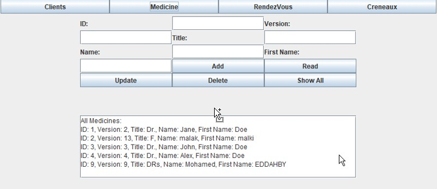
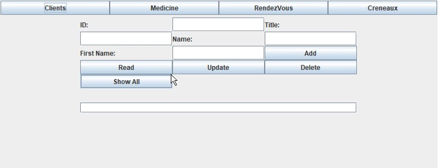
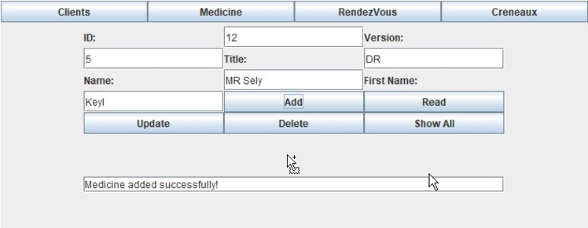

# Medical Center App

🏥 Welcome to the Medical Center App! This Java application is designed to manage and facilitate tasks within a medical center, utilizing a MySQL database for data storage.

## Table of Contents

- [Features](#features)
- [Technologies Used](#technologies-used)
- [Getting Started](#getting-started)
  - [Prerequisites](#prerequisites)
  - [Installation](#installation)
- [Usage](#usage)
- [Database Setup](#database-setup)
- [Contributing](#contributing)
- [License](#license)
- [Acknowledgments](#acknowledgments)

## Features

- **Patient Management:** Add, edit, and view patient information.
- **Appointment Scheduling:** Schedule and manage patient appointments.
- **Medical Records:** Keep track of patient medical records.
- **User Authentication:** Secure login system for authorized access.

## Technologies Used

- Java
- MySQL
- Swing

## Getting Started

### Prerequisites

Before you begin, ensure you have met the following requirements:

- Java Development Kit (JDK) installed
- MySQL database server installed

### Installation

1. **Clone the repository:**

   ```bash
   git clone https://github.com/Mededdahby/Medicale-Center-App.git
   ```

## screenshots

| Doctor Management                             | Patient Management                            |
| --------------------------------------------- | --------------------------------------------- |
|  |  |

| Medical Records                            | Add Doctor                                |
| ------------------------------------------ | ----------------------------------------- |
|  |  |
| Medical Records                            | User Authentication                       |
| ------------------                         | ----------------------                    |

##License
📄 Copyright © 2024 MedoxEddahby
📄 This project is licensed under the MIT License - see the LICENSE.md file for details.
